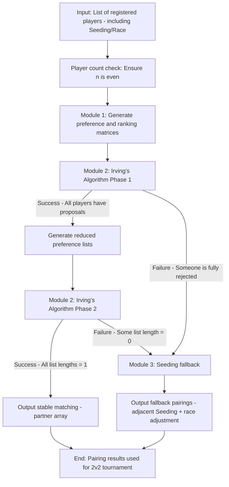

```plaintext
SC2_2v2_Pairing/
├─ include/                // Header file directory (external interfaces)
│  ├─ model/               // Data model headers
│  │  ├─ Player.h          // Player data structure (ID, Seeding, race, etc.)
│  │  └─ MatchData.h       // Pairing result data structure (stable match/fallback match)
│  ├─ generator/           // Preference list generator headers
│  │  └─ PreferenceGenerator.h  // Generate preference/ranking matrices based on Seeding
│  ├─ solver/              // Irving's algorithm solver headers
│  │  └─ IrvingSolver.h    // Encapsulates core logic for Phase 1/Phase 2
│  ├─ backup/              // Fallback matching headers
│  │  └─ BackupMatcher.h   // Seeding-based fallback logic for unsolvable scenarios
│  ├─ utils/               // Utility function headers
│  │  ├─ MatrixUtils.h     // 2D matrix operations (initialization, printing, querying)
│  │  └─ CycleDetector.h   // Cycle detection utility for Phase 2 ("all-or-nothing cycles")
│  └─ io/                  // Input/output headers
│     ├─ DataReader.h      // Reads player data (reserved crawler interface)
│     └─ ResultWriter.h    // Outputs pairing results (console/file)
├─ src/                    // Source file directory (implementation details)
│  ├─ model/
│  │  ├─ Player.cpp
│  │  └─ MatchData.cpp
│  ├─ generator/
│  │  └─ PreferenceGenerator.cpp
│  ├─ solver/
│  │  └─ IrvingSolver.cpp
│  ├─ backup/
│  │  └─ BackupMatcher.cpp
│  ├─ utils/
│  │  ├─ MatrixUtils.cpp
│  │  └─ CycleDetector.cpp
│  ├─ io/
│  │  ├─ DataReader.cpp
│     └─ ResultWriter.cpp
│  └─ main.cpp
├─ test/                   // Test directory (based on Google Test)
│  ├─ TestPreferenceGenerator.cpp  // Tests preference list generation (total order requirements per documentation)
│  ├─ TestIrvingPhase1.cpp         // Tests Phase 1 (proposal-rejection process)
│  ├─ TestIrvingPhase2.cpp         // Tests Phase 2 (cycle reduction process)
│  ├─ TestBackupMatcher.cpp        // Tests fallback logic (unsolvable cases per documentation)
│  └─ TestFullFlow.cpp             // Tests complete workflow (input→matching→output)
├─ config/                 // Configuration file directory (modifiable parameters without code changes)
│  └─ PairingConfig.ini    // Race priorities, Seeding weights, output paths, etc.
├─ document/
├─ CMakeLists.txt          // Build script (cross-platform compilation)
└─ README.md               // Project documentation (compilation steps, interface documentation)
```

# SC2 2v2 Pairing System

A C++ implementation of the Irving Algorithm for Stable Roommates Problem (SRP) tailored for StarCraft II 2v2 tournament teammate pairing, with seeding-based backup matching.

## Prerequisites

- Visual Studio 2022 (MSVC 19.30+)

- CMake 4.0.2+

- Google Test (for unit tests)

- C++17 or later
  
  ## Build Instructions
1. Clone the repository

2. Create a `build` directory: `mkdir build && cd build`
   
   ```bash
   # 1. Create a build directory (to isolate build artifacts from source code)
   mkdir build && cd build
   
   # 2. Generate Visual Studio 2022 solution (x64 architecture) - compatible with CMake 4.0.2
   cmake .. -G "Visual Studio 17 2022" -A x64
   
   # 3. Optional: Build the project directly via CMake (Release configuration)
   cmake --build . --config Release
   
   # 4. Optional: Build only the main executable (Release configuration)
   cmake --build . --config Release --target SC2_2v2_Pairing
   
   # 5. Optional: Build only the unit tests (Release configuration)
   cmake --build . --config Release --target SC2_2v2_Pairing_Tests
   ```
   
   

3. Generate VS2022 solution: `cmake .. -G "Visual Studio 17 2022" -A x64`

4. Open `SC2_2v2_Pairing.sln` in VS2022

5. Build in Release/Debug configuration
   
   ## Configuration
- Modify `config/PairingConfig.ini` to adjust:
  
  - Output path for match results
  
  - Race priority for preference generation
  
  - Seeding/race weights
  
  - Backup matcher settings
    
    ## Input Data

- Place player data in `config/player_data.csv` with format:
  
  PlayerID,SeedingRank,Race,MMR
  
  P1,1,P,4500.0
  
  P2,2,T,4400.0
  
  ...

- Supported races: P (Protoss), T (Terran), Z (Zerg), R (Random)
  
  ## Output

- Match results are printed to console and written to `output/match_result.txt`

- Results include:

- Match type (Stable/Backup)

- Player pairings

- Detailed algorithm execution log
  
  ## Testing

- Run `SC2_2v2_Pairing_Tests.exe` to execute unit tests

- Tests cover:

- Preference list generation

- Irving Algorithm Phase 1/2

- Backup matcher

- Full end-to-end flow


