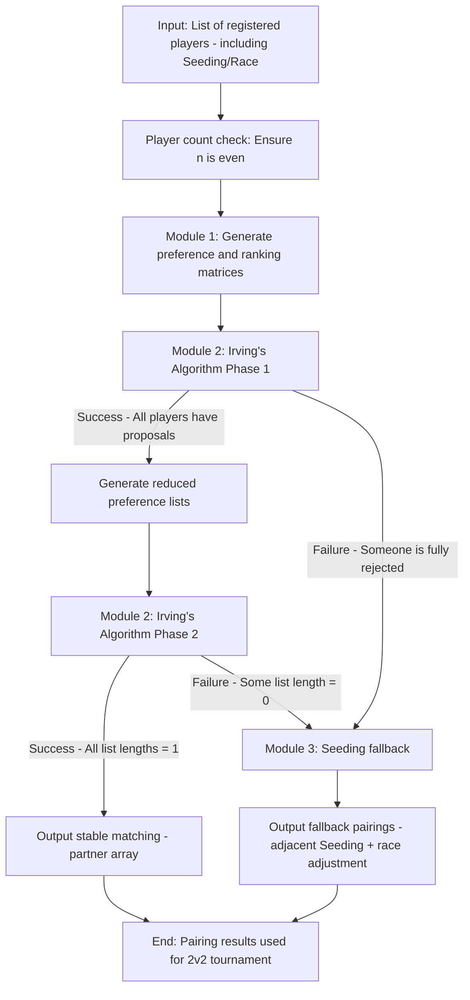

```mermaid
graph TD
    A[Input: List of registered players - including Seeding/Race] --> B[Player count check: Ensure n is even]
    B --> C[Module 1: Generate preference and ranking matrices]
    C --> D[Module 2: Irving's Algorithm Phase 1]
    D -->|Success - All players have proposals| E[Generate reduced preference lists]
    D -->|Failure - Someone is fully rejected| H[Module 3: Seeding fallback]
    E --> F[Module 2: Irving's Algorithm Phase 2]
    F -->|Success - All list lengths = 1| G[Output stable matching - partner array]
    F -->|Failure - Some list length = 0| H
    H --> I[Output fallback pairings - adjacent Seeding + race adjustment]
    G --> J[End: Pairing results used for 2v2 tournament]
    I --> J
```

